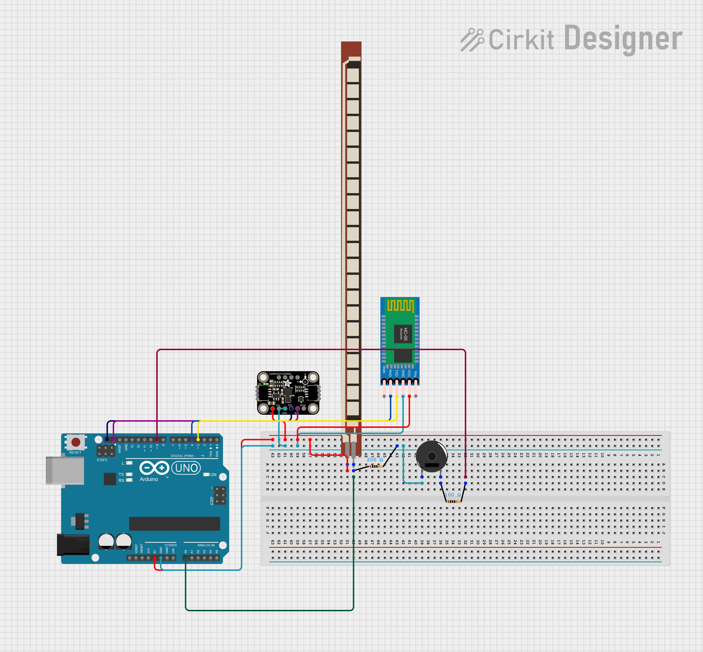
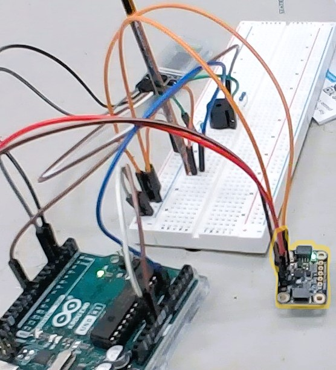
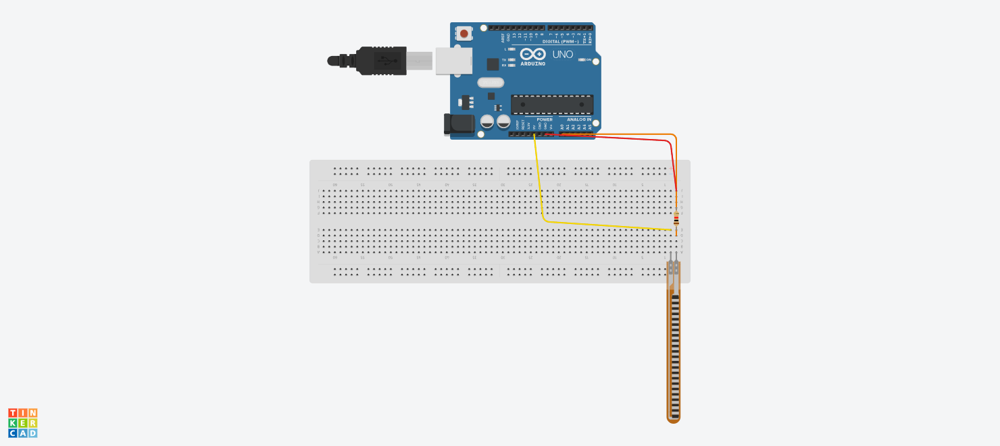
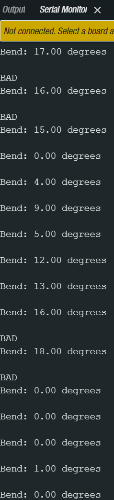

# Wrist Rehabilitation Device
My Wrist Rehabilitation Device uses sensors to monitor the angle of the wrist and beeps when the wrist bends too far. It uses an arduino, a gyroscope and accelerometer, and a flex sensor. It has a bluetooth module which allows it to transmit data to the user's computer without the arduino being plugged in. This could be used to prevent and help with carpal tunnel syndrome, or other wrist pains caused by bad posture. 


| **Engineer** | **School** | **Area of Interest** | **Grade** |
|:--:|:--:|:--:|:--:|
| Mikul R | Saratoga High School | Mechanical Engineering | Incoming Sophomore


  
<!--# Final Milestone

**Don't forget to replace the text below with the embedding for your milestone video. Go to Youtube, click Share -> Embed, and copy and paste the code to replace what's below.**

<iframe width="560" height="315" src="https://www.youtube.com/embed/F7M7imOVGug" title="YouTube video player" frameborder="0" allow="accelerometer; autoplay; clipboard-write; encrypted-media; gyroscope; picture-in-picture; web-share" allowfullscreen></iframe>

For your final milestone, explain the outcome of your project. Key details to include are:
- What you've accomplished since your previous milestone
- What your biggest challenges and triumphs were at BSE
- A summary of key topics you learned about
- What you hope to learn in the future after everything you've learned at BSE

-->

# Second Milestone

<iframe width="560" height="315" src="https://www.youtube.com/embed/y3VAmNlER5Y" title="YouTube video player" frameborder="0" allow="accelerometer; autoplay; clipboard-write; encrypted-media; gyroscope; picture-in-picture; web-share" allowfullscreen></iframe>
<div style="text-align: center;">
  <h3># Milestone 2 Schematic</h3>
</div>
<div style="text-align: center;">
  
</div>
<p>I first added the LSM6DS3 + LIS3MDL module to my circuit, which includes a gyroscope, accelerometer, and magnetometer. Out of these 3 sensors, I had to determine which one of those would best be suited for the purpose of my wrist device. I originally thought the gyroscope would be the best to use, but as I printed the values, I realized the accelerometer values were the ones changing as I turned the module, so I decided to use those. The accelerometer measures the acceleration of the module as the name suggests while the gyroscope measures the rate of rotation, or angular velocity, of an object. Since the movement is relatively slow, the measured angular velocity might have been below the sensitivity threshold of the gyroscope, causing it to report small values which weren’t very helpful. The accelerometer was able to quantify the movement of the module to bigger numbers which would help more in this context. 
</p>
<p>I also added a piezo buzzer. Piezo buzzers work by applying an alternating voltage to a piezoelectric ceramic material, which causes the material to vibrate rapidly and produce sound waves. A piezo buzzer needs a resistor to reset the voltage when the switch is open, which is why I added a 100 ohm resistor to the circuit. 
</p>
<p>The bluetooth module is called the HC-05, and I was using it to wirelessly transmit data from the arduino to my computer. 2 of the pins on the module, the RX and TX, are the serial communication pins. These have to be connected to the opposite pin on the arduino, so the RX has to go to the TX port and the TX has to go to the RX port. This is because the labels refer to the device itself, not the other device it's connected to.
</p>
<p>One challenge I faced was with the bluetooth module where it wasn’t connecting to my computer and the arduino. I realized in my settings, I had to turn on advanced bluetooth search so that the HC-05 module showed up because the default mode only displays common devices like headphones, printers, etc. 
</p>
<p>Another challenge was connecting the accelerometer module to the breadboard because the breadboard pins it came with weren’t conducting the power well and the gyroscope wasn’t consistently on. To fix this, I tried to put the wires through the module itself into the breadboard, but even that didn't work. I concluded that there was probably a faulty connection within the breadboard, so I put the module on its own with the jumper wires touching the through  
</p>
<div style="text-align: center;">
  
</div>
<p>The next steps of my project are to solder the components onto a pcb board instead of the breadboard so it could be put on the wrist sleeve, and connect everything to the wrist sleeve. After everything, I will test and debug to make sure my project is finished successfully. </p>


# First Milestone
<iframe width="560" height="315" src="https://www.youtube.com/embed/4qdVO-jCbHY?si=K4MMR2H-8GmGsBDG" title="YouTube video player" frameborder="0" allow="accelerometer; autoplay; clipboard-write; encrypted-media; gyroscope; picture-in-picture; web-share" referrerpolicy="strict-origin-when-cross-origin" allowfullscreen></iframe>
<p>My first step forward was to work on the flex sensor portion of my schematic as well as coding the flex sensor to print out its values and figure out when the angle is a bad angle. The ideal wrist angle is 20 degrees or less, but since the flex sensor has some variability, I set the limit to 18 degrees. This was challenging because a flex sensor is actually a resistor, so the output of the sensor is a resistance value. Because of this, there had to be an algorithm which converts the resistance recorded to an angle.</p>

<p>One challenge I faced was not seeing values in the output tab. Initially, I thought there was an issue with my code and referenced online sources, but my code appeared correct. I then realized I needed to open the Serial Monitor in Arduino IDE, as the output tab is for code outputs, while the Serial Monitor displays data transmitted from the Arduino.
</p>
<p>Another problem was that the angle values read -35 degrees when the wrist was straight, instead of 0 degrees. I discovered the resistance value I defined for the resistor in my circuit was incorrect. After researching the resistor's possible resistance range and using a multimeter, I determined the exact value. I also used the color-coded bands on the resistor to confirm the precise resistance</p>
<p>The next step for me is to wire up the remaining components like the accelerometer, gyroscope, and buzzer. I will also try to connect the Bluetooth module and send sensor data to the computer through that. </p>

<p>Below is my code that I have completed so far. So far it calculates the angle of the flex sensor, while also setting a limit to the angle:</p>
```c++
const int FLEX_PIN = A0; // Pin connected to voltage divider output

const float VCC = 4.98; // Measured voltage of Ardunio 5V line
const float R_DIV = 10000.0; // Measured resistance of resistor
const float STRAIGHT_RESISTANCE = 15000.0; // resistance when straight
const float BEND_RESISTANCE = 70000.0; // resistance at 90 deg
void setup() {
  Serial.begin(9600);
  pinMode(FLEX_PIN, INPUT);
}
void loop() {
  // Read the ADC, and calculate voltage and resistance from it
  int flexADC = analogRead(FLEX_PIN);
  float flexV = flexADC * VCC / 1023.0;
  float flexR = R_DIV * (VCC / flexV - 1.0);
  // Use the calculated resistance to estimate the sensor's bend angle:
  float angle = map(flexR, STRAIGHT_RESISTANCE, BEND_RESISTANCE,
                   0, 90.0);
  Serial.println("Bend: " + (String(angle)) + " degrees");
  Serial.println();
  if ((angle) > 15) {
    Serial.println("BAD");
  }
  delay(1000);

}

```
<!--# Schematics 
Here's where you'll put images of your schematics. [Tinkercad](https://www.tinkercad.com/blog/official-guide-to-tinkercad-circuits) and [Fritzing](https://fritzing.org/learning/) are both great resoruces to create professional schematic diagrams, though BSE recommends Tinkercad becuase it can be done easily and for free in the browser. 

# Code
Here's where you'll put your code. The syntax below places it into a block of code. Follow the guide [here]([url](https://www.markdownguide.org/extended-syntax/)) to learn how to customize it to your project needs. 

```c++
const int FLEX_PIN = A0; // Pin connected to voltage divider output

const float VCC = 4.98; // Measured voltage of Ardunio 5V line
const float R_DIV = 10000.0; // Measured resistance of resistor
const float STRAIGHT_RESISTANCE = 15000.0; // resistance when straight
const float BEND_RESISTANCE = 70000.0; // resistance at 90 deg
void setup() {
  Serial.begin(9600);
  pinMode(FLEX_PIN, INPUT);
}
void loop() {
  // Read the ADC, and calculate voltage and resistance from it
  int flexADC = analogRead(FLEX_PIN);
  float flexV = flexADC * VCC / 1023.0;
  float flexR = R_DIV * (VCC / flexV - 1.0);
  // Use the calculated resistance to estimate the sensor's bend angle:
  float angle = map(flexR, STRAIGHT_RESISTANCE, BEND_RESISTANCE,
                   0, 90.0);
  Serial.println("Bend: " + (String(angle)) + " degrees");
  Serial.println();
  if ((angle) > 15) {
    Serial.println("BAD");
  }
  delay(1000);

}
```
<p>Below is what is displayed in the serial monitor in Arduino IDE from the above code. When the degree values become greater than or equal to 15, then the code displays "BAD", but later this will translate to a beep</p>


# Bill of Materials
Here's where you'll list the parts in your project. To add more rows, just copy and paste the example rows below.
Don't forget to place the link of where to buy each component inside the quotation marks in the corresponding row after href =. Follow the guide [here]([url](https://www.markdownguide.org/extended-syntax/)) to learn how to customize this to your project needs. 

| **Part** | **Note** | **Price** | **Link** |
|:--:|:--:|:--:|:--:|
| Arduino Uno Rev3 | Microcontroller which everything connects to and contains all the code | $27.60 | <a href="https://www.amazon.com/Arduino-A000066-ARDUINO-UNO-R3/dp/B008GRTSV6/"> Link </a> |
| HC-05 Bluetooth Module | Wireless communication with the computer | $10.39 | <a href="https://www.amazon.com/HiLetgo-Wireless-Bluetooth-Transceiver-Arduino/dp/B071YJG8DR/"> Link </a> |
| Adafruit LSM6DS3TR-C + LIS3MDL - Precision 9 DoF IMU | Gyroscope, Accelerometer, and Magnetometer | $19.95 | <a href="https://www.adafruit.com/product/5543?gad_source=1&gclid=Cj0KCQjw4MSzBhC8ARIsAPFOuyW3bKrwhMSo2VoSfvSt319uDnnbDld4MoYm0IzXAV2mbivYMjEGez4aApeGEALw_wcB"> Link </a> |
<!--
# Other Resources/Examples
One of the best parts about Github is that you can view how other people set up their own work. Here are some past BSE portfolios that are awesome examples. You can view how they set up their portfolio, and you can view their index.md files to understand how they implemented different portfolio components.
- [Example 1](https://trashytuber.github.io/YimingJiaBlueStamp/)
- [Example 2](https://sviatil0.github.io/Sviatoslav_BSE/)
- [Example 3](https://arneshkumar.github.io/arneshbluestamp/)

-->
# Starter Project - Calculator
<iframe width="560" height="315" src="https://www.youtube.com/embed/wXEsTbNK6yc?si=MvtolE11zvuNi826" title="YouTube video player" frameborder="0" allow="accelerometer; autoplay; clipboard-write; encrypted-media; gyroscope; picture-in-picture; web-share" referrerpolicy="strict-origin-when-cross-origin" allowfullscreen></iframe>
<p>My starter project was the calculator, and I chose this project because it seemed like a fun project and it required a lot of soldering which I wanted to practice. The calculator has 17 buttons with 4 functions: 1) addition, 2) subtraction, 3) multiplication, and 4) division. Another button on the calculator, the On/Clear button, turns on the calculator, and while the calculator is on, if pressed again, the numbers displayed on the LED (Light Emitting Diode) display are cleared. All these buttons are soldered down along with a 7 segment 6 digit LED digital display tube. Each digit is formed by 7 different LED segments, which individually light up and turn off to display different numbers. The component near the top of the calculator is an Integrated Circuit which has an Arithmetic Logic Unit (ALU), a digital circuit used to perform arithmetic and logic operations.</p>
<p>One challenge I faced was that the LED display only was showing 2 and wasn't allowing me to press any other buttons. After debugging, I found out that the button was stuck on the frame, and after I release it, the calculator worked perfectly. From this project, I improved my soldering skills while also learning how to debug properly. I will apply everything I learned so far on my main project, the Wrist Rehabilitation Monitor.</p>
